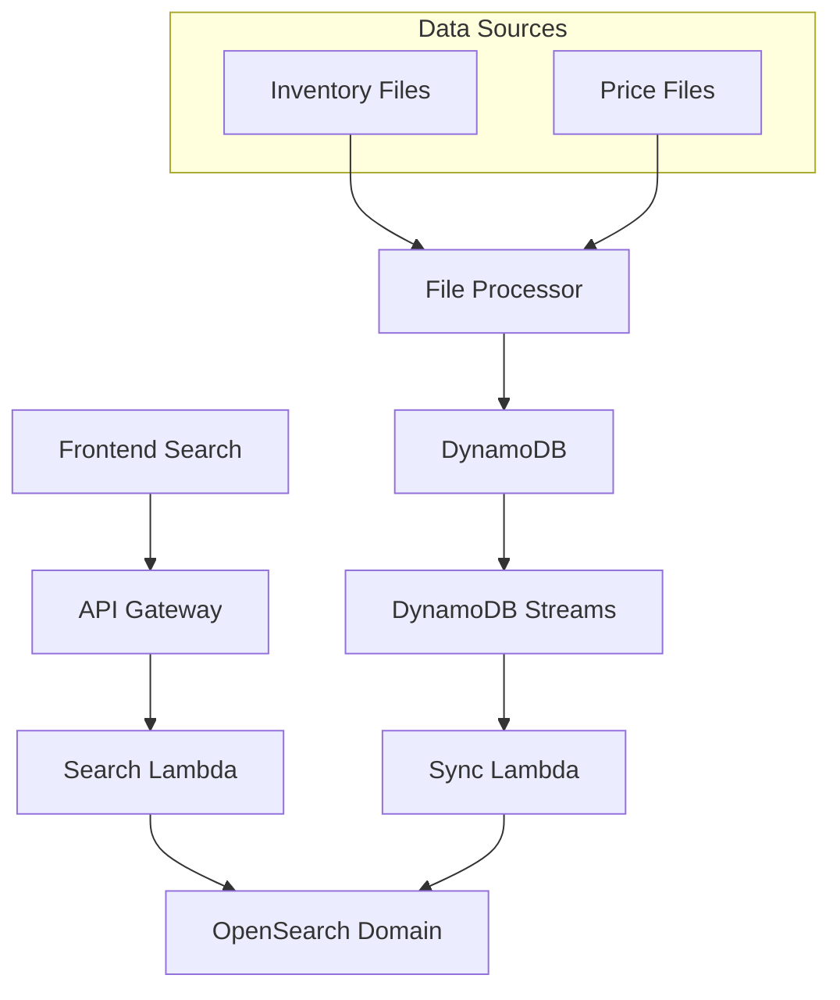

# OpenSearch Configuration

## Overview

The Varekatalog backend uses AWS OpenSearch 3.1 for full-text product search and catalog indexing. This document details the configuration and architecture.

## Infrastructure Details

### OpenSearch Domain Configuration

- **Domain Name**: `eas-dev-varekatalog`
- **Domain Endpoint**: `search-eas-dev-varekatalog-3krcwwbqhnaakuc262vionkxl4.eu-west-1.es.amazonaws.com`
- **OpenSearch Version**: 3.1
- **Instance Type**: `t3.small.elasticsearch`
- **Instance Count**: 1 (development environment)
- **Region**: `eu-west-1`

### Index Configuration

**Primary Index**: `eas-varekatalog-products`

The index contains Norwegian building supplies product data with the following structure:

```json
{
  "mappings": {
    "properties": {
      "vvsnummer": {
        "type": "keyword",
        "fields": {
          "text": {
            "type": "text",
            "analyzer": "standard"
          }
        }
      },
      "produktnavn": {
        "type": "text",
        "analyzer": "norwegian"
      },
      "kategori": {
        "type": "keyword"
      },
      "leverandør": {
        "type": "keyword"
      },
      "pris": {
        "type": "float"
      },
      "lagerstatus": {
        "type": "keyword"
      },
      "anbrekk": {
        "type": "keyword"
      }
    }
  }
}
```

## Backend Integration

### Lambda Functions

1. **DynamoDB Sync Function** (`eas-varekatalog-dynamodb-sync-dev`)
   - Syncs DynamoDB changes to OpenSearch index
   - Handles real-time updates from product data changes
   - Environment variables:
     - `OPENSEARCH_DOMAIN`: Domain endpoint
     - `OPENSEARCH_INDEX`: `eas-varekatalog-products`

2. **Search API Function** (`eas-varekatalog-search-api-dev`)
   - Handles frontend search requests
   - Queries OpenSearch domain directly
   - Returns formatted product results

3. **Index Setup Function** (`eas-varekatalog-index-setup-dev`)
   - Creates and configures index mappings
   - Sets up Norwegian language analyzers
   - Manages index lifecycle

### Authentication & Security

- **IAM-based Access**: Lambda functions use IAM roles for OpenSearch access
- **VPC Security**: Domain is secured within AWS VPC
- **API Gateway**: Frontend requests go through authenticated API Gateway endpoints

## Search Architecture



## Search Capabilities

### Supported Query Types

1. **Full-text Search**: Product names, descriptions
2. **VVS Number Search**: Exact 8-digit product codes
3. **Category Filtering**: Product categories
4. **Supplier Filtering**: Leverandør names
5. **Stock Status Filtering**: På lager, Få igjen, Utsolgt
6. **Price Range Filtering**: Min/max price ranges

### Norwegian Language Support

- **Analyzer**: Custom Norwegian analyzer for product names
- **Stop Words**: Norwegian stop words filtered
- **Stemming**: Norwegian stemming for better matching
- **Synonyms**: Building supplies terminology synonyms

## Frontend Integration

### API Endpoints

- **Search**: `POST /search`
- **Product Details**: `GET /products/{id}`
- **Prices** (authenticated): `GET /products/{id}/prices`
- **Inventory** (authenticated): `GET /products/{id}/inventory`

### Error Handling

The frontend handles these OpenSearch-related errors:

- `illegal_argument_exception`: Index configuration issues
- `search_phase_execution_exception`: Query parsing errors
- `index_not_found_exception`: Missing index
- `cluster_block_exception`: Cluster read-only mode

## Troubleshooting

### Common Issues

1. **Index Not Found**
   - **Symptom**: `index_not_found_exception`
   - **Solution**: Run index setup Lambda function
   - **Command**: Trigger `eas-varekatalog-index-setup-dev`

2. **Field Data Error**
   - **Symptom**: `illegal_argument_exception: fielddata=true`
   - **Solution**: Update index mapping to enable fielddata for sorting fields
   - **Fix**: Reindex with proper mapping configuration

3. **Cluster Read-Only**
   - **Symptom**: `cluster_block_exception`
   - **Solution**: Check disk space and cluster health
   - **Monitoring**: CloudWatch metrics for disk utilization

4. **Search Timeout**
   - **Symptom**: Query timeout errors
   - **Solution**: Optimize query complexity or increase timeout
   - **Monitoring**: Check query performance metrics

### Monitoring & Logging

- **CloudWatch Logs**: Lambda function logs contain OpenSearch query details
- **Metrics**: Domain metrics available in CloudWatch
- **Alerts**: SNS topic `eas-varekatalog-alerts-dev` for critical issues

### Performance Optimization

- **Index Refresh**: Set to appropriate interval for near real-time updates
- **Shard Configuration**: Single shard for development, scale for production
- **Query Caching**: Leverage OpenSearch query result caching
- **Connection Pooling**: Lambda functions use connection pooling

## Development & Testing

### Local Testing

Frontend connects to the development OpenSearch domain through API Gateway endpoints. No direct OpenSearch access from local development.

### Index Management

Use AWS CLI or Lambda functions to manage indices:

```bash
# Trigger index setup
aws lambda invoke \
  --function-name eas-varekatalog-index-setup-dev \
  response.json

# Check domain status
aws opensearch describe-domain \
  --domain-name eas-dev-varekatalog
```

## Production Considerations

For production deployment:

1. **Multi-AZ**: Deploy across multiple availability zones
2. **Instance Types**: Upgrade to larger instances (m5.large.elasticsearch)
3. **Replica Shards**: Configure replica shards for redundancy
4. **Dedicated Master**: Use dedicated master nodes
5. **Security**: Implement fine-grained access control
6. **Encryption**: Enable encryption at rest and in transit