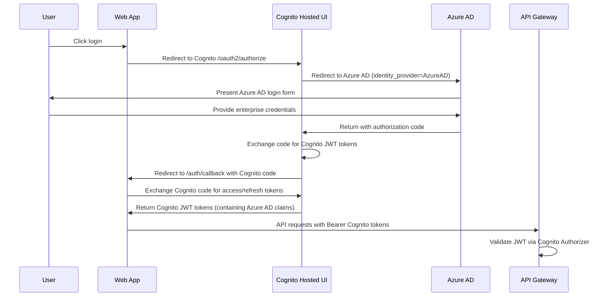

# Authentication Flow Fix Plan: Azure AD via AWS Cognito Integration

**Document Version**: 1.0  
**Date**: September 4, 2025  
**Status**: Implementation Ready  
**Priority**: Critical - Blocking Authentication Functionality  

## Instructions for Executing Agent

**CRITICAL**: Before starting implementation, you MUST read and understand the complete context from these files:

### **Available Tools for Investigation:**
You have access to **AWS MCP tools** for investigating and validating the backend configuration:
- Use AWS CLI commands to inspect Cognito User Pool configuration
- Check API Gateway authorizer settings
- Validate Cognito OAuth domain and client settings
- Review CloudWatch logs for authentication errors
- Use these tools to verify the backend architecture matches the documentation

**Example Investigation Commands:**
```bash
# Check Cognito User Pool details
aws cognito-idp describe-user-pool --user-pool-id eu-west-1_EIDmPWkK2

# Check User Pool client configuration
aws cognito-idp describe-user-pool-client --user-pool-id eu-west-1_EIDmPWkK2 --client-id vuuc11qdf11tnst6i3c7fhc6p

# List identity providers configured in Cognito
aws cognito-idp list-identity-providers --user-pool-id eu-west-1_EIDmPWkK2
```

### **Required Reading - Backend Architecture Context:**
1. `/home/rydesp/dev/easmith-varekatalog-backend/docs/architecture/oauth-system-architecture-documentation.md` - Complete OAuth architecture design
2. `/home/rydesp/dev/easmith-varekatalog-backend/docs/architecture/oauth-technical-specifications.md` - Technical implementation details
3. `/home/rydesp/dev/easmith-varekatalog-backend/docs/oauth-deployment-guide.md` - Deployment and configuration guide

### **Required Reading - Frontend Context:**
1. `/home/rydesp/dev/easmith-varekatalog-frontend/CLAUDE.md` - Project context and development guidelines
2. `/home/rydesp/dev/easmith-varekatalog-frontend/hooks/useAuth.ts` - Current broken authentication implementation
3. `/home/rydesp/dev/easmith-varekatalog-frontend/components/auth/LoginButton.tsx` - Current login component
4. `/home/rydesp/dev/easmith-varekatalog-frontend/app/auth/callback/page.tsx` - Current OAuth callback handler

### **Key Integration Points to Understand:**
- **Backend Architecture**: Azure AD → AWS Cognito → API Gateway → Lambda Functions
- **AWS Cognito User Pool**: `eu-west-1_EIDmPWkK2` (Production User Pool)
- **Azure AD Integration**: Azure AD acts as OIDC Identity Provider within Cognito
- **OAuth Scopes**: `varekatalog/prices`, `varekatalog/inventory` (managed by Cognito Resource Server)
- **API Gateway**: Uses Cognito Authorizer for JWT validation
- **Environment**: Must work in both local development and AWS Amplify production

---

## Problem Summary

### **Current Broken Implementation**
The frontend currently attempts **direct Azure AD authentication**, but the backend architecture requires **AWS Cognito as the authentication gateway** that delegates to Azure AD. This causes the redirect URI mismatch error:

```
AADSTS50011: The redirect URI 'http://localhost:3000/auth/callback' specified in the request 
does not match the redirect URIs configured for the application
```

### **Root Cause Analysis**
1. **LoginButton.tsx** redirects directly to `login.microsoftonline.com` (Azure AD)
2. **auth/callback** tries to exchange Azure AD authorization codes directly
3. **useAuth.ts** mixes AWS Cognito SDK with direct Azure AD OAuth configuration
4. **Missing Cognito Hosted UI integration** - the correct authentication entry point

### **Architecture Mismatch**
- **Frontend Implementation**: Direct Azure AD OAuth 2.0 flow
- **Backend Expectation**: AWS Cognito-managed OAuth with Azure AD as identity provider
- **Result**: Authentication tokens incompatible with API Gateway Cognito Authorizer

---

## Solution Architecture

### **Correct Authentication Flow** (from backend architecture documentation)


### **Key Architectural Components**
1. **Cognito Hosted UI**: Single entry point for all authentication
2. **Azure AD Integration**: Configured as OIDC Identity Provider in Cognito
3. **Cognito JWT Tokens**: Contain Azure AD user claims + Cognito resource server scopes
4. **API Gateway Authorization**: Validates Cognito JWT signatures automatically

---

## Implementation Plan

### **Phase 1: Fix Authentication Hook**
**File**: `hooks/useAuth.ts`

**Current Problems:**
- Mixed Azure AD OAuth config with Cognito User Pool SDK
- Direct username/password authentication (wrong for enterprise SSO)
- Manual JWT parsing instead of using Cognito session management

**Required Changes:**
1. Remove all Azure AD direct OAuth configuration
2. Remove username/password `authenticateUser()` calls
3. Implement Cognito Hosted UI OAuth flow
4. Use Cognito OAuth endpoints exclusively
5. Store and manage Cognito JWT tokens
6. Extract OAuth scopes from Cognito JWT tokens

**New Authentication Flow:**
```typescript
// Replace direct Azure AD OAuth with Cognito Hosted UI
const authConfig = {
  cognitoDomain: 'varekatalog-users-prod.auth.eu-west-1.amazoncognito.com',
  clientId: process.env.NEXT_PUBLIC_COGNITO_CLIENT_ID!,
  redirectUri: `${window.location.origin}/auth/callback`,
  scopes: ['openid', 'profile', 'email', 'varekatalog/prices', 'varekatalog/inventory']
};
```

### **Phase 2: Update Login Button**
**File**: `components/auth/LoginButton.tsx`

**Current Problems:**
- Redirects to `login.microsoftonline.com` (bypassing Cognito)
- Uses Azure AD OAuth parameters
- Hardcoded scope format incompatible with Cognito

**Required Changes:**
1. Redirect to Cognito Hosted UI OAuth endpoint
2. Use Cognito OAuth 2.0 parameters
3. Add `identity_provider=AzureAD` to force Azure AD login through Cognito
4. Implement PKCE for security (OAuth 2.0 best practice)

**New Login URL Format:**
```typescript
const authUrl = `https://${cognitoDomain}/oauth2/authorize?` + new URLSearchParams({
  response_type: 'code',
  client_id: clientId,
  redirect_uri: redirectUri,
  scope: 'openid profile email varekatalog/prices varekatalog/inventory',
  identity_provider: 'AzureAD',  // Forces Azure AD login
  code_challenge: pkceChallenge,
  code_challenge_method: 'S256'
}).toString();
```

### **Phase 3: Fix OAuth Callback Handler**
**File**: `app/auth/callback/page.tsx`

**Current Problems:**
- Exchanges authorization codes with Azure AD token endpoint
- Uses Azure AD token format
- Stores tokens incompatible with API Gateway

**Required Changes:**
1. Handle Cognito OAuth callback (not Azure AD)
2. Exchange Cognito authorization code for Cognito JWT tokens
3. Store Cognito access/refresh tokens correctly
4. Extract user scopes from Cognito JWT claims

**New Token Exchange:**
```typescript
const tokenUrl = `https://${cognitoDomain}/oauth2/token`;
const tokenParams = {
  grant_type: 'authorization_code',
  client_id: clientId,
  code: authorizationCode,
  redirect_uri: redirectUri,
  code_verifier: pkceVerifier  // PKCE verification
};
```

### **Phase 4: Environment Variables Configuration**
**Required Environment Variables:**
```bash
# AWS Cognito Configuration (KEEP EXISTING)
NEXT_PUBLIC_COGNITO_CLIENT_ID=vuuc11qdf11tnst6i3c7fhc6p
NEXT_PUBLIC_COGNITO_USER_POOL_ID=eu-west-1_EIDmPWkK2

# NEW: Cognito OAuth Domain
NEXT_PUBLIC_COGNITO_DOMAIN=varekatalog-users-prod.auth.eu-west-1.amazoncognito.com

# REMOVE: Direct Azure AD variables (not needed in frontend)
# NEXT_PUBLIC_AZURE_TENANT_ID  <- Remove
# NEXT_PUBLIC_AZURE_CLIENT_ID  <- Remove

# OAuth Scopes (UPDATE FORMAT)
NEXT_PUBLIC_OAUTH_SCOPES=openid profile email varekatalog/prices varekatalog/inventory
```

---

## Detailed Technical Specifications

### **OAuth 2.0 + PKCE Implementation**
Following backend architecture requirements for security:

```typescript
// PKCE (Proof Key for Code Exchange) Implementation
function generatePKCE() {
  const codeVerifier = generateRandomString(128);
  const codeChallenge = base64URLEncode(sha256(codeVerifier));
  
  return {
    codeVerifier,
    codeChallenge,
    codeChallengeMethod: 'S256'
  };
}
```

### **JWT Token Structure** (from Cognito)
```json
{
  "sub": "user-uuid",
  "aud": "vuuc11qdf11tnst6i3c7fhc6p",
  "cognito:groups": [],
  "email_verified": true,
  "iss": "https://cognito-idp.eu-west-1.amazonaws.com/eu-west-1_EIDmPWkK2",
  "cognito:username": "AzureAD_user@byggern.no",
  "given_name": "User",
  "family_name": "Name", 
  "aud": "vuuc11qdf11tnst6i3c7fhc6p",
  "identities": [{
    "userId": "user@byggern.no",
    "providerName": "AzureAD",
    "providerType": "OIDC"
  }],
  "token_use": "access",
  "scope": "openid profile email varekatalog/prices varekatalog/inventory",
  "auth_time": 1693827600,
  "exp": 1693856400,
  "iat": 1693827600
}
```

### **API Integration Changes**
No changes required to API integration - the backend expects Cognito JWT tokens in the Authorization header:

```typescript
// API requests (no changes needed)
headers: {
  'Authorization': `Bearer ${cognitoAccessToken}`,
  'Content-Type': 'application/json'
}
```

---

## Testing Checklist

### **Phase 1 Testing: Authentication Hook**
- [ ] `useAuth` hook initializes without errors
- [ ] No direct Azure AD OAuth configuration present
- [ ] Cognito OAuth URLs are correctly constructed
- [ ] PKCE parameters generated securely

### **Phase 2 Testing: Login Flow**
- [ ] Login button redirects to Cognito hosted UI
- [ ] Cognito redirects to Azure AD login page
- [ ] Azure AD authentication succeeds
- [ ] Callback returns to `/auth/callback` with Cognito authorization code

### **Phase 3 Testing: Token Exchange**
- [ ] Authorization code exchanges successfully for Cognito tokens
- [ ] JWT tokens contain correct Azure AD claims
- [ ] OAuth scopes are correctly extracted
- [ ] Tokens stored securely in session/local storage

### **Phase 4 Testing: API Integration**
- [ ] API requests include Cognito Bearer tokens
- [ ] API Gateway Cognito Authorizer validates tokens successfully
- [ ] Scope-based data filtering works correctly
- [ ] Unauthenticated requests still work for public endpoints

### **Cross-Environment Testing**
- [ ] **Local Development**: `http://localhost:3000` authentication works
- [ ] **AWS Amplify Develop**: `https://develop.d226fk1z311q90.amplifyapp.com` authentication works
- [ ] **Production**: Authentication works in production environment

---

## Rollback Plan

### **If Implementation Fails**
1. **Revert authentication files**: `git checkout HEAD~1 hooks/useAuth.ts components/auth/ app/auth/`
2. **Restore environment variables**: Revert to previous `.env` configuration
3. **Test basic functionality**: Ensure unauthenticated search still works
4. **Document issues**: Record specific error messages for debugging

### **Debugging Tools**
1. **AWS MCP Tools**: Use available AWS CLI commands to inspect configuration
   ```bash
   # Debug Cognito configuration
   aws cognito-idp describe-user-pool --user-pool-id eu-west-1_EIDmPWkK2
   aws cognito-idp describe-user-pool-client --user-pool-id eu-west-1_EIDmPWkK2 --client-id vuuc11qdf11tnst6i3c7fhc6p
   
   # Check identity providers
   aws cognito-idp list-identity-providers --user-pool-id eu-west-1_EIDmPWkK2
   
   # Review recent authentication events
   aws logs filter-log-events --log-group-name /aws/cognito/userpool/eu-west-1_EIDmPWkK2
   ```
2. **Browser Developer Tools**: Network tab for OAuth flow inspection
3. **Cognito Console**: AWS Cognito logs for authentication events
4. **CloudWatch**: API Gateway and Lambda function logs
5. **JWT Decoder**: Verify token structure and claims

---

## Success Criteria

### **Functional Requirements**
- [ ] Users can login via Azure AD through Cognito Hosted UI
- [ ] Authentication works in both development and production environments
- [ ] JWT tokens are valid for API Gateway authorization
- [ ] OAuth scopes correctly control data visibility
- [ ] Session management handles token refresh automatically

### **Security Requirements**
- [ ] PKCE implemented for OAuth 2.0 security
- [ ] No sensitive credentials exposed in frontend code
- [ ] JWT tokens stored securely
- [ ] CSRF protection via state parameter validation

### **Performance Requirements**
- [ ] Authentication flow completes within 10 seconds
- [ ] Token validation cached appropriately
- [ ] No performance degradation for authenticated API requests

---

## Post-Implementation Tasks

### **Documentation Updates**
1. Update `CLAUDE.md` with new authentication flow
2. Document environment variable requirements
3. Add authentication troubleshooting guide

### **Monitoring Setup**
1. Add CloudWatch alerts for authentication failures
2. Monitor OAuth flow completion rates
3. Track API authorization success/failure rates

### **Team Training**
1. Update development onboarding documentation
2. Share authentication flow diagrams with team
3. Document common troubleshooting scenarios

---

**IMPLEMENTATION PRIORITY**: Critical - Authentication is completely broken until this is fixed. The current frontend cannot authenticate with the existing backend architecture.