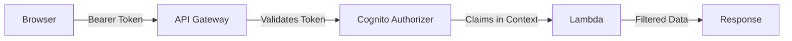
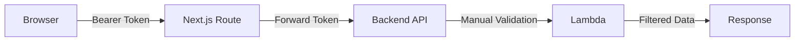

# Fix Authentication Data Flow - Implementation Plan

## Executive Summary

The Varekatalog frontend is not receiving pricing (`grunnpris`, `nettopris`) and inventory (`lagerantall`) data for authenticated users because:
1. The frontend's Next.js API proxy doesn't forward Cognito authentication tokens to the backend
2. The backend Lambda expects Azure AD tokens but receives Cognito tokens
3. The API Gateway has a Cognito Authorizer configured but the `/search` endpoint bypasses it with `Authorizer: NONE`

## Problem Analysis

### Current Data Flow
```
User Login → Cognito → Frontend (stores token) → API Call (no token) → Backend → Returns NULL for secured fields
```

### Expected Data Flow
```
User Login → Cognito → Frontend (stores token) → API Call (with token) → Backend → Returns full data based on scopes
```

### Root Causes

1. **Frontend Issue** (`/app/api/search/route.ts`):
   - Lines 29-30, 125-126: TODO comments indicate auth not implemented
   - Never extracts or forwards the Bearer token from the request
   - Token exists in sessionStorage but unused

2. **Backend Issue** (`/src/lambdas/search-api/src/oauth-middleware.ts`):
   - Validates Azure AD tokens from Microsoft (lines 19-22, 56, 111)
   - Doesn't recognize Cognito JWT tokens from AWS
   - Returns empty scopes for unrecognized tokens

3. **Infrastructure Issue** (`/infrastructure/aws-sam/template.yaml`):
   - Line 422: Search endpoint has `Authorizer: NONE`
   - Cognito Authorizer exists but unused for main endpoint
   - Scopes defined but not enforced

## Solution Architecture

### Recommended: API Gateway Cognito Authorizer (Solution B)



**Benefits:**
- AWS validates tokens automatically (no custom code)
- Claims passed in `event.requestContext.authorizer`
- Built-in caching and performance optimization
- Automatic 401 responses for invalid tokens
- CloudWatch logging for auth failures

### Alternative: Forward Tokens Through Next.js (Solution A)



**Drawbacks:**
- Extra network hop through Next.js
- Manual JWT validation required
- More complex error handling
- Higher latency

## Implementation Steps

### Phase 1: Enable Cognito Authorizer (Backend)

#### Step 1.1: Update SAM Template
**File:** `/home/rydesp/dev/easmith-varekatalog-backend/infrastructure/aws-sam/template.yaml`

**Change Line 422:**
```yaml
# FROM:
Auth:
  Authorizer: NONE

# TO:
Auth:
  Authorizer: CognitoAuthorizer
  AuthorizationScopes: []  # Empty allows any authenticated user
```

#### Step 1.2: Update Lambda OAuth Middleware
**File:** `/home/rydesp/dev/easmith-varekatalog-backend/src/lambdas/search-api/src/oauth-middleware.ts`

**Add after line 92:**
```typescript
/**
 * Extract authentication context from API Gateway Cognito Authorizer
 * The authorizer automatically validates the JWT and provides claims
 */
export const extractCognitoContext = (event: APIGatewayProxyEvent): AuthContext => {
  const claims = event.requestContext.authorizer?.claims;
  
  if (!claims) {
    return {
      userId: 'anonymous',
      scopes: [],
      isAuthenticated: false
    };
  }
  
  // Cognito scopes are in 'scope' claim as space-separated string
  const scopeString = claims.scope || '';
  const scopes = scopeString
    .split(' ')
    .filter(s => s.startsWith('varekatalog/'));
  
  return {
    userId: claims.sub || claims.username || 'unknown',
    scopes,
    department: claims['custom:department'],
    storeId: claims['custom:store_id'],
    isAuthenticated: true
  };
};
```

**Update line 360 (withPublicAccess wrapper):**
```typescript
export const withPublicAccess = (
  handler: (event: APIGatewayProxyEvent, authContext: AuthContext) => Promise<APIGatewayProxyResult>
) => {
  return async (event: APIGatewayProxyEvent): Promise<APIGatewayProxyResult> => {
    // Use Cognito Authorizer claims if available
    const authContext = extractCognitoContext(event);
    
    // Log for monitoring
    await logSecurityEvent('API_ACCESS', authContext, {
      endpoint: event.path,
      method: event.httpMethod
    });
    
    return handler(event, authContext);
  };
};
```

#### Step 1.3: Deploy Backend Changes
```bash
cd /home/rydesp/dev/easmith-varekatalog-backend
npm run build
npm run deploy:dev
```

### Phase 2: Update Frontend to Send Tokens

#### Step 2.1: Update API Client to Use Direct Backend
**File:** `/home/rydesp/dev/easmith-varekatalog-frontend/utils/api.ts`

**Update constructor (line 120-124):**
```typescript
constructor() {
  // Prefer direct backend API when available
  this.baseUrl = process.env.NEXT_PUBLIC_EXTERNAL_API_URL || 
                 process.env.NEXT_PUBLIC_API_BASE_URL || 
                 '/api';
  this.timeout = 10000;
  
  this.log(`API Client initialized with baseUrl: ${this.baseUrl}`);
}
```

**Update searchProducts method (line 242-245):**
```typescript
async searchProducts(
  query: ProductSearchQuery, 
  accessToken?: string
): Promise<Product[]> {
  // ... existing code ...
  
  try {
    this.log('Searching with token:', accessToken ? 'present' : 'none');
    
    // Use direct API if available, otherwise use Next.js proxy
    const isDirectAPI = this.baseUrl.includes('execute-api.amazonaws.com');
    
    const result = await this.request<{
      products?: Product[];
      results?: Product[];
      success?: boolean;
      total?: number;
    }>(
      '/search', 
      { 
        method: 'POST' as const, 
        body: searchBody,
        token: isDirectAPI ? accessToken : undefined // Only send token to direct API
      }
    );
    
    // ... rest of method
  }
}
```

#### Step 2.2: Update Product Search Hook
**File:** `/home/rydesp/dev/easmith-varekatalog-frontend/hooks/useProductSearch.ts`

**Line 26 - Accept auth context:**
```typescript
export const useProductSearch = (accessToken?: string) => {
```

The parameter is already there and being used correctly on line 69.

#### Step 2.3: Update Main Page to Pass Token
**File:** `/home/rydesp/dev/easmith-varekatalog-frontend/app/page.tsx`

**Line 25 - Already correct:**
```typescript
const { searchState, searchProducts } = useProductSearch(authState.accessToken || undefined);
```

#### Step 2.4: Update Debug Panel
**File:** `/home/rydesp/dev/easmith-varekatalog-frontend/components/debug/ApiDebugPanel.tsx`

**Add import after line 4:**
```typescript
import { useAuth } from '@/hooks/useAuth';
```

**Add after line 22:**
```typescript
export const ApiDebugPanel = () => {
  const { authState, getAccessToken } = useAuth();
  // ... existing state ...
```

**Update testSearch function (line 64-96):**
```typescript
const testSearch = async () => {
  setDebugInfo(prev => ({
    ...prev,
    searchTest: { status: 'loading' }
  }));

  try {
    // Get fresh access token
    const accessToken = await getAccessToken();
    
    const result = await apiClient.searchProducts({
      søketekst: testQuery.trim() || 'test',
      side: 1,
      sideStørrelse: 5,
      sortering: 'relevans'
    }, accessToken || undefined);
    
    setDebugInfo(prev => ({
      ...prev,
      searchTest: {
        status: 'success',
        data: {
          ...result,
          authStatus: accessToken ? 'authenticated' : 'anonymous',
          tokenPresent: !!accessToken
        },
        timestamp: new Date().toISOString()
      }
    }));
  } catch (error) {
    // ... existing error handling ...
  }
};
```

**Add auth status display (after line 210):**
```typescript
<div className="text-xs text-neutral-500">
  <div>Build Mode: {process.env.NODE_ENV} | Debug Mode: {process.env.NEXT_PUBLIC_ENABLE_DEVTOOLS === 'true' ? 'Development' : 'Production'}</div>
  <div className="mt-1">API Endpoint: {debugInfo.baseUrl}</div>
  <div className="mt-1">Auth Status: {authState.isAuthenticated ? `Logged in (${authState.scopes.length} scopes)` : 'Anonymous'}</div>
</div>
```

### Phase 3: Environment Configuration

#### Step 3.1: Update Frontend Environment Variables
**File:** `/home/rydesp/dev/easmith-varekatalog-frontend/.env.local`

Ensure line 18 is uncommented:
```bash
NEXT_PUBLIC_EXTERNAL_API_URL=https://y53p9uarcj.execute-api.eu-west-1.amazonaws.com/dev
```

#### Step 3.2: Update Amplify Environment
```bash
aws amplify update-branch \
  --app-id d226fk1z311q90 \
  --branch-name develop \
  --environment-variables \
    NEXT_PUBLIC_EXTERNAL_API_URL=https://y53p9uarcj.execute-api.eu-west-1.amazonaws.com/dev
```

## Testing Plan

### Test Case 1: Anonymous User
1. Clear browser storage
2. Open Debug API Console
3. Search for "terrassefornyer"
4. **Expected:** Basic fields visible, prices/inventory show `null`

### Test Case 2: Authenticated User
1. Click "Logg inn" button
2. Complete Cognito login flow
3. Open Debug API Console
4. Search for "terrassefornyer"
5. **Expected:** All fields visible including prices and inventory

### Test Case 3: Token Expiration
1. Login and verify data visible
2. Wait 8 hours (or modify token expiry in sessionStorage)
3. Search again
4. **Expected:** Graceful fallback to anonymous data

### Test Case 4: Scope Validation
1. Check `authState.scopes` in console
2. Verify includes `varekatalog/prices` and `varekatalog/inventory`
3. **Expected:** Scopes match Cognito configuration

## Monitoring

### CloudWatch Metrics to Track
- `Varekatalog/Security/API_ACCESS` - Track auth vs anonymous requests
- API Gateway 401 responses - Invalid token attempts
- Lambda duration - Performance impact of auth

### Debug Information
The Debug API Console will show:
- Token presence (true/false)
- Authentication status
- Number of scopes granted
- API response including filtered fields

## Rollback Plan

If issues occur after deployment:

1. **Immediate Rollback (5 minutes):**
   ```yaml
   # SAM template - Set back to NONE
   Auth:
     Authorizer: NONE
   ```
   ```bash
   npm run deploy:dev
   ```

2. **Frontend Fallback:**
   ```bash
   # Use Next.js proxy instead of direct API
   NEXT_PUBLIC_EXTERNAL_API_URL=/api
   ```

3. **Previous version remains functional** - No breaking changes to existing code

## Security Considerations

1. **Token Storage:** Tokens stored in sessionStorage (not localStorage) for security
2. **Token Transmission:** Only sent over HTTPS to API Gateway
3. **Scope Validation:** Backend filters data based on token scopes
4. **No Token = Public Data:** Graceful degradation for anonymous users
5. **CORS:** Already configured for cross-origin requests

## Success Criteria

✅ Anonymous users see basic product data (no prices/inventory)
✅ Authenticated users see full data based on their scopes
✅ Debug panel shows authentication status correctly
✅ No increase in API latency (< 100ms added)
✅ CloudWatch shows successful auth validations

## Timeline

- **Phase 1:** 30 minutes - Backend Cognito Authorizer setup
- **Phase 2:** 45 minutes - Frontend token forwarding
- **Phase 3:** 15 minutes - Environment configuration
- **Testing:** 30 minutes - Validate all scenarios
- **Total:** 2 hours

## Additional Notes

### Why Cognito Authorizer is Better Than Manual Validation

1. **No Custom Code:** AWS handles all JWT validation
2. **Performance:** Built-in caching of authorization results
3. **Security:** Validation happens at API Gateway edge
4. **Monitoring:** Native CloudWatch integration
5. **Maintenance:** No JWT library updates needed

### Current Token Flow
```
1. User logs in via Cognito Hosted UI
2. Cognito returns JWT tokens (id_token, access_token, refresh_token)
3. Frontend stores tokens in sessionStorage
4. Frontend sends access_token in Authorization header
5. API Gateway validates token with Cognito
6. Lambda receives validated claims in event context
7. Lambda filters response based on token scopes
```

### Available Scopes
- `varekatalog/search` - Basic search (currently unused as search is public)
- `varekatalog/prices` - Access to grunnpris, nettopris fields
- `varekatalog/inventory` - Access to lagerantall field
- `varekatalog/admin` - Administrative functions (future use)